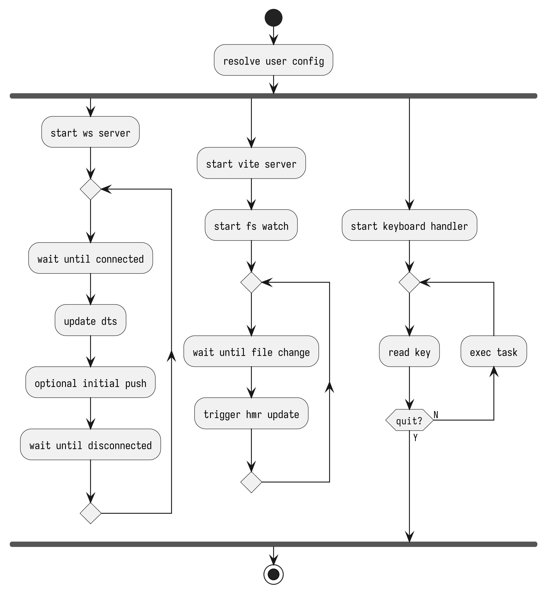

# Overview

## Resolve Config

During the startup, viteburner will resolve the config file and start the server. See [Config File Path](../config/config-file-path.md) for more details about where to put your config file.

## Setup WebSocket Server

Viteburner will start a WebSocket Server to be connected by bitburner through Remote File API.

- See [Server Options](../config/server-options.md) for more details about the server options and the dts file options.
- See [Download Options](../config/download-options.md) for more details about the initial push options.

## Setup Vite Server and Watcher

Viteburner will start a Vite Server and a Watcher to watch the files and transform them.

- See [Upload Options](../config/upload-options.md) for more details about the watch and upload options.
- See [Dump Options](../config/dump-options.md) for more details about the dump options.
- See [Transform Options](../config/transform-options.md) and [Transform](transform.md) for more details about the transform.

## Key Handler

Once setup is done, viteburner will start a key handler to handle the keypresses.

- Press `h` to show the help message.
- Press `q` to quit viteburner. (or `ESC`, `Ctrl+C`, `Ctrl+D` to force quit)
- Press `u` to upload the files.
- Press `d` to download the files.
- Press `r` to show RAM usage of scripts.
